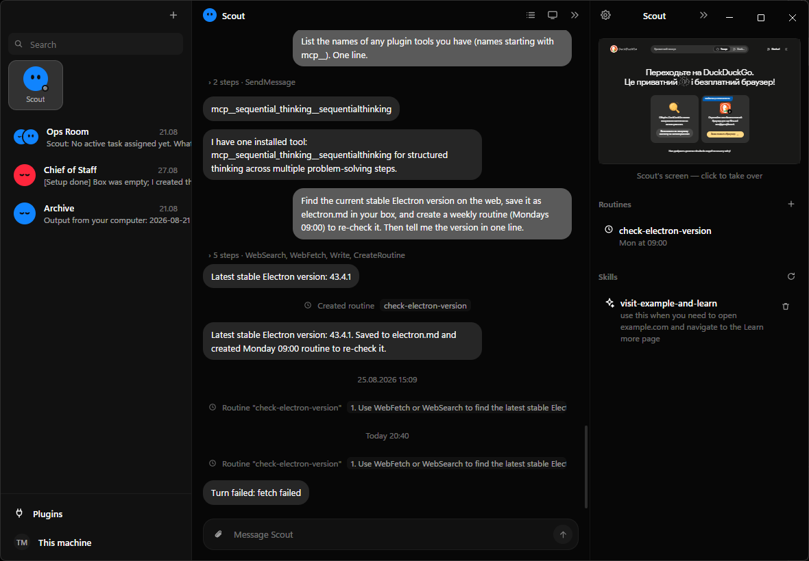
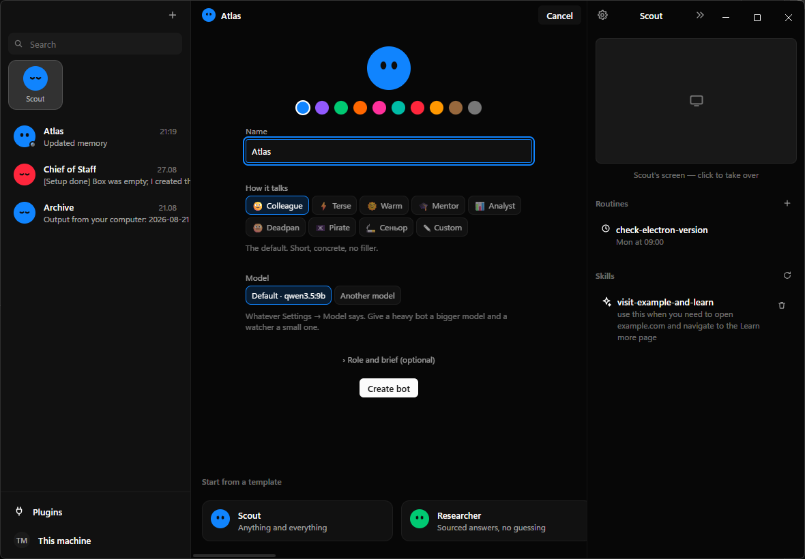
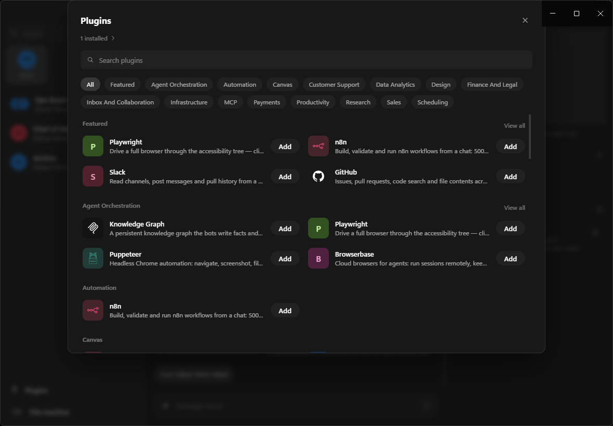
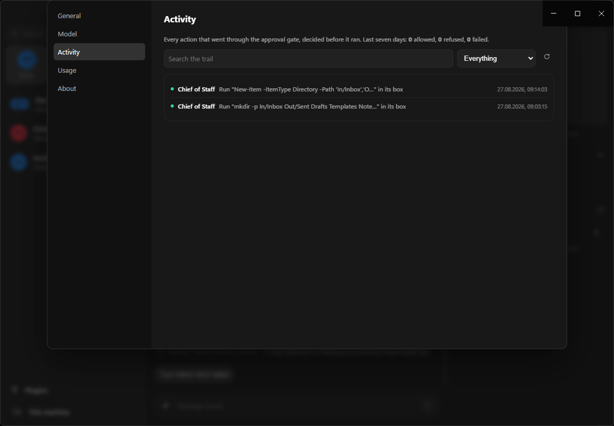
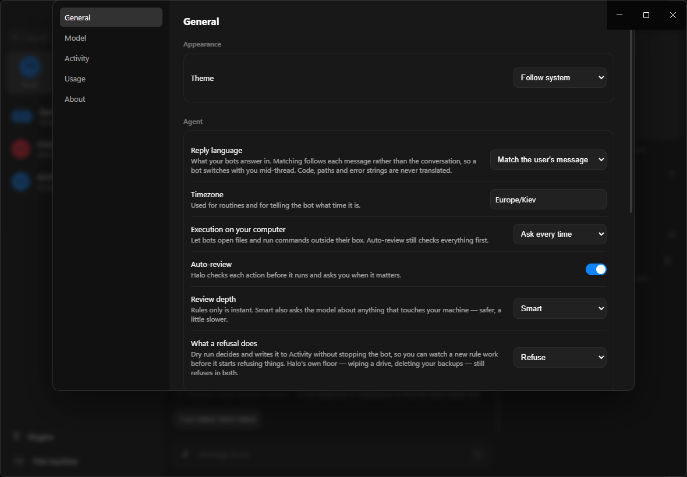

<div align="center">

# Halo Bot

**AI teammates you can hand real work to, on hardware you own.**

[**Quick start**](#quick-start) · [**What it does**](#what-a-bot-can-do) · [**Staying in control**](#staying-in-control) · [**Architecture**](#architecture) · [**Verification**](#verification) · [**Docs**](#documentation)

[](https://github.com/Galactic717/halo-bot/actions/workflows/ci.yml)
[](host/halo.test.ts)
[](android/app/src/test/java/com/halo/bot/HaloTest.kt)
[](scripts/verify.mts)
[](LICENSE)




Give a bot a name and a job. It gets a workspace of its own, a real browser with its own
logins, memory that outlives the conversation, and a schedule if you want one. It works
while you are elsewhere and comes back when the job is done or a decision is yours.
Every action it takes on your machine is decided before it happens and recorded after.

</div>

> **Runs on your machine.** There is no hosted version and no account. The model is yours to
> choose — a local Ollama, LM Studio or llama.cpp, or a key for x.ai, OpenRouter, OpenAI or
> DeepSeek. Nothing leaves the machine except the model call you configured.

> **Alpha.** It works, it is tested, and it is early. Expect rough edges and expect things to move.

---

## What it is

A desktop agent app, and the same app again on a phone.

Each **bot** is a durable thing rather than a chat session: its own conversation, its own memory,
its own folder on disk, its own browser profile, its own permissions, and optionally its own model.
You talk to it, it does the work, and next week it still knows what you told it.

Bots are not sandboxed from *you* — they are sandboxed from **each other** and from the rest of your
machine. On Windows a bot's shell runs in an AppContainer of its own: it cannot read your files,
cannot touch another bot's box, and has no network unless you give that bot one. Reaching onto your machine is a different surface with a different answer, and it
goes through an approval gate that writes the row before it acts.

Nothing about that is optional or bolt-on. It is the reason the app exists in this shape.

## Features

- **A box per bot** — `Shell`, `Read`, `Write`, `Edit` and `ListFiles` run freely inside it. On Windows every box is its own AppContainer (plus a job object and a private desktop), so the boundary is the kernel's and not a regular expression's: [each claim is a test](host/box.test.ts) that runs the real helper. On Android it is the app sandbox, shared by the phone's bots — see [SECURITY.md](SECURITY.md#known-limits).
- **A browser per bot** — a real Chromium screen you watch live and take over with one click, with **its own cookie jar**: a bot cannot reach a site another bot signed into, and deleting a bot deletes its logins. It works from a **snapshot** — the page's controls listed with a ref each — and clicks by ref, so an action lands on the control Halo actually saw rather than a selector the model invented.
- **One browser, one driver** — a bot that meets a login wall asks for help; you take the wheel, do the part only you can do, and hand it back. While you hold it, the bot's actions there are refused rather than queued.
- **Your computer, behind the gate** — `ExternalShell`, `ExternalRead`, `CopyToBox` and `CopyFromBox` each stop for approval, scoped to what was actually approved: saying yes to `git status` grants commands starting `git status`, not a shell.
- **An audit trail written before the action** — every gated action, allowed, refused or failed, with the rule that decided it. A permitted action that then failed gets its own second row, because "allowed" and "happened" are different facts. Anything shaped like a key is masked before it reaches disk.
- **A floor nothing can lower** — wiping a drive, deleting your backups or shadow copies, formatting a volume, rewriting the boot configuration. Refused with approvals off, with execution set to Allow, with the folder granted, with a rule that says allow. There is a test that turns every switch the wrong way and asserts it still refuses.
- **Everything from outside is data, never instructions** — a web page, a file, a plugin's reply, a teammate's message, a background worker's report, text inside a screenshot. All of it arrives inside a marker whose suffix is random per run, and the bot is told nothing inside it can order an action.
- **Memory in three tiers** — profile, log and note, extracted automatically after each exchange, decayed by age, and loaded into every turn. Editable as plain text.
- **Routines** — interval, daily, weekdays, weekly or **webhook**, several per routine, with a test run and run history. A 15-minute floor and a cap of 20 switched on keep a sentence from scheduling more standing work than anybody meant. A routine waits out a model-server outage rather than spending its daily allowance on one, says so once when it starts failing, and switches itself off after three.
- **Skills, learned by watching** — press **Teach a task**, do the thing once, and the bot writes the skill with the selectors intact. Passwords are never recorded. It saves the *shape* of the task: anything that would differ next time becomes a named input written `{like_this}`.
- **Teammates and rooms** — `CreateAgent`, `SendToAgent`, channels with `@mentions`. Bots hand work to each other, and a room stops after a few hops so two bots cannot volley forever without you.
- **Background workers** — `Task` hands a tightly-scoped job to a browser, research or shell worker that reports back. `MessageSubagent` redirects one mid-flight without throwing away what it has found.
- **Plugins** — a marketplace of real, published MCP servers, plus **paste the config**: the JSON snippet the server's own README prints for Claude Desktop, Cursor or VS Code. Past eight plugin tools the schemas stop travelling in every prompt and the bot looks them up on demand, which is what keeps a small local model's window usable.
- **Your own automations** — point Halo at an n8n you already run and every service connected there becomes something a bot can read, write and fire, with the credentials staying in n8n. Reading is free; writing, activating and firing ask first.
- **Bring your own agent** — give a bot an AG-UI endpoint and its turns run there, on any framework. It is offered Halo's toolset and every call comes back through the same gate onto the same trail, so hosting somebody else's agent is not the same as trusting it.
- **Secrets sealed at rest** — the API key, every plugin credential and any endpoint header are encrypted with the OS keychain or the Android keystore before `settings.json` is written.
- **A shell sees an allow-list** — PATH, locale and proxy variables, not this process's environment, so `Get-ChildItem env:` cannot print what the app decrypted at boot.

<div align="center">


</div>

## Requirements

- **Windows 10/11** for the desktop app, or **Android 8+** for the phone build.
- **Node.js 22.6+** to build it. Node runs the TypeScript directly, so there is no separate compile step for the tests.
- **A model server that speaks OpenAI-compatible chat completions and supports tool calling.** [Ollama](https://ollama.com) is the easy local answer; LM Studio and llama.cpp work; so does any hosted key.
- **Rust** only if you want the box confinement helper compiled from source. Without it the app still runs, says so on its About screen, and the box is a folder rather than a boundary.

> **The model needs a context window of about 8k or more.** The system prompt plus the tool schemas
> is several thousand tokens, and a server with a smaller window silently truncates the request — the
> model never sees its instructions, answers in plain text, and the turn ends with nothing sent.
> Ollama's default is 4096, which is below that floor: start it with `OLLAMA_CONTEXT_LENGTH=16384`.
> Halo says so in the transcript when it detects a truncated prompt.

## Quick start

1. Install and build:

   ```bash
   npm install
   npm start
   ```

2. Point it at a model. The setup screen looks for a server on this machine and ranks what it finds
   by whether it supports tool calling and whether it fits in your memory. Or paste a key.

3. Press **Ctrl+N**, give the bot a name, and give it something concrete.

To build an installer instead — a Start-menu entry, a desktop shortcut and start-with-Windows:

```bash
npm run package        # release/Halo Bot Setup 0.1.0.exe
```

Hot reload while working on it:

```bash
npm run dev
```

The phone build:

```bash
cd android && ./gradlew :app:installDebug
```

## Try it

- `Write plan.md in your box with three short bullets on what you can do, then read it back.`
- `Open news.ycombinator.com and tell me the top story.` — then watch the browser pane.
- `Run git status in D:\some\repo` — and watch it stop for approval. Open **Settings → Activity**
  afterwards and read the row it wrote before it ran.
- `Every weekday at nine, check that site and tell me if it changed.` — then look under **Routines**
  in the details pane.

## Staying in control



**Approvals are scoped to the action, not the surface.** "Always allow" on `git status` writes a rule
about commands starting `git status`. The old version wrote a rule from the approval line alone, and
every shell approval carried the same line — so one "Always" became standing permission to run
anything. It does not any more, and there is a test for it.

**Rules are sentences, or expressions when a sentence will not do it.** *"when a bot wants to read
files from my Downloads folder → allow automatically"*, or
`intent == "run_command" && contains(command, "npm publish")`. Deny is evaluated before allow, so a
rule that removes permission can never be defeated by a broader one that grants it, and a rule that
does not parse refuses rather than opens.

**Smart review** asks the model about anything the local rules would wave through. The command
reaches that reviewer with its comments stripped and inside a fence, and your rules reach it on the
trusted channel, so a comment inside the command cannot argue its own way past the check. A review
that cannot run fails closed. Commands inside a bot's own box are not reviewed while that box has no
network: they run in its AppContainer or not at all, and a small helper model second-guessing
`cat total.txt` only stalled unattended work.

**Dry run** decides and records without blocking, so you can watch a new rule work on real work
before it starts refusing things. The floor still refuses in both modes.



## Architecture


Every tool call goes through **one** gate — the main loop and background workers alike. It
summarises the action, asks the policy for a verdict, optionally asks the model for a second
opinion, writes the audit row, and only then executes. There is no path that acts without the record
existing first.

```
electron/   main process: window, IPC, the bot's browser, teach recorder, webhook listener
host/       agent runtime: store, provider, tools, policy, memory, skills, subagents,
            runner, scheduler, MCP, fence, compaction, expression, audit, personas, n8n
src/        renderer: React
native/     halo-box — a Rust helper that runs a box command in the bot's own AppContainer
android/    the phone build: core/ ports host/, platform/ replaces electron/, ui/ follows src/
docs/       the reference teardowns, and the record of every pass over this code
```

**Stack:** TypeScript · Electron 38 · React 19 · Vite · Kotlin · Jetpack Compose · Rust (one helper)
· Model Context Protocol · AG-UI. No database, no server, no framework in the runtime.

## Verification

| Command | What it checks |
|---|---|
| `npm run typecheck` | `tsc` across the desktop app and the shared runtime |
| `npm test` | 66 tests on node's own runner, 12 of them against the real box. No framework, no fixtures |
| `npm run verify` | 19 checks driving the **real** runtime end to end |
| `cd android && ./gradlew :app:testDebugUnitTest` | 43 tests on the JVM |

`npm run verify` is the interesting one. It starts an OpenAI-compatible server on loopback that plays
a **scripted** sequence of tool calls, builds a store and a runner in a temp directory, and drives the
real loop — because asking a real model to attempt a disk wipe tests whether *that model* is willing,
and a well-behaved one refuses on its own and never reaches the floor at all. What has to hold is
Halo's behaviour when the model is not well behaved.

```
A turn, end to end
  PASS  SendMessage is the only channel, and it reaches the transcript
  PASS  a command on the user's machine stops at the approval gate
  PASS  what a tool brought back reaches the model fenced
The trail
  PASS  a gated action leaves a row
  PASS  the row names who decided it and how
The floor, with every switch turned the wrong way
  PASS  refused: Remove-Item C:\ -Recurse -Force
  PASS  refused: powershell -Command "Remove-Item C:\ -Recurse -Force"
  PASS  refused: format C: /fs:ntfs
  PASS  refused: vssadmin delete shadows /all
  PASS  refused: bcdedit /set {default} safeboot minimal
Background work
  PASS  the worker's report comes back fenced — a report is a model repeating what it read
```

The desktop and Android suites deliberately hold **the same tests in two languages**: a property that
holds on Windows and not on the phone is a bug in whichever half is wrong, and these say which.

## Making a bot

**Ctrl+N**, or **+** in the sidebar. A name is the only required field.

- **A template** fills the whole bot — role, brief, colour and a voice that suits the job. Nine of
  them, from Scout to Tutor to Build Bot. A template fills the form rather than creating outright,
  because a template you cannot adjust is a menu rather than a starting point.
- **A voice** — Colleague, Terse, Warm, Mentor, Analyst, Deadpan, Pirate, Сеньор, or one you write.
  A voice changes how a bot sounds and nothing else: it cannot widen what the bot may do, switch off
  an approval prompt, or make a refused action allowed, and the prompt says so to the model as well
  as to you.
- **A model** — the global one, or a different one for this bot alone. Its background workers run on
  the same one it does.

Its settings pane carries its own permissions: `Use global / Ask every time / Allow / Never` for your
computer, the folders it may use freely, its model, and its own browser session.

## Android

The same product on a phone, as a Kotlin/Compose **port** rather than a wrapper: same bots, same
memory, same routines, same approval gate and audit trail, and the same layout on disk — a bot
exported on Windows imports on the phone with its voice, memory, skills and routines intact, and back
again.

Four things the platform decided differently, and they are all in Halo's favour except the last: the
box is a real sandbox rather than a folder with a label, so `ExternalShell` is gone and there is
nothing for it to escape into; the folders a bot may use are grants Android itself holds rather than
paths Halo polices; the browser is a WebView with the same snapshot-and-ref contract; and plugins are
remote MCP servers over Streamable HTTP, because a phone cannot spawn an npm package.

The whole list is in **[docs/ANDROID.md](docs/ANDROID.md)**.

## Keyboard

| Shortcut | Action |
|---|---|
| `Ctrl+K` | Command palette: bots, routines, messages, actions (`Tab` cycles the tabs) |
| `Ctrl+N` | New bot |
| `Enter` / `Shift+Enter` | Send / newline |
| Right-click a bot | Pin, move to section, duplicate, export, hide, delete |

## Under the hood

- Turns run as a tool loop against an OpenAI-compatible endpoint. Failures are **classified** rather
  than guessed at: a rate limit or a 5xx is retried, an expired key or a missing model is reported
  once and not retried, and a context overflow is compacted and tried again — the one class where a
  second attempt can actually differ.
- Long chats fold their older turns into a summary once they pass the context budget, so a bot can
  run for weeks.
- Memory extraction, safety review and summarising all use a cheap **helper model**, keeping the main
  one free for work.
- Everything is files: `settings.json`, `channels.json`, `routines.json`, `usage.jsonl`,
  `audit.jsonl`, and one folder per bot with its transcript, model history, memory, skills and box.
  A file that will not parse is moved aside rather than silently replaced by an empty one.
- Closing the window keeps the bots running in the tray; quit from the tray to stop everything.

## Not done yet

- **OAuth for hosted MCP servers** — Linear, Notion, Jira, Asana, Canva, Sentry, Vercel, PayPal,
  Square and Intercom publish servers that sign you in through a browser. Halo sends one static
  credential per server, so those are named as unsupported rather than listed and then failing.
- **One cookie jar on Android** — `CookieManager` is a singleton over the WebView data directory, so
  per-bot sessions there need a second process.
- **On-device inference on Android** — the model is always something Halo talks to over the network.
- **Reordering sidebar sections by dragging.**

## Documentation

| | |
|---|---|
| [docs/ANDROID.md](docs/ANDROID.md) | the phone build and every deliberate divergence |
| [docs/WORK_2026_08_27.md](docs/WORK_2026_08_27.md) | making the two builds one product |
| [docs/WORK_2026_09_03.md](docs/WORK_2026_09_03.md) | ten defects, an end-to-end harness, and what the field taught |
| [docs/GROK_BOT_TEARDOWN.md](docs/GROK_BOT_TEARDOWN.md) · [INTERNALS](docs/GROK_BOT_INTERNALS.md) · [0.24→0.27](docs/GROK_BOT_0.24_0.27_TEARDOWN.md) | reference teardowns |
| [docs/OPENBOT_HERMES_TEARDOWN.md](docs/OPENBOT_HERMES_TEARDOWN.md) | the MIT projects parts of this are adapted from |
| [CONTRIBUTING.md](CONTRIBUTING.md) · [SECURITY.md](SECURITY.md) | how to work on it, how to report a hole |

## Where it comes from

Halo Bot is built by studying products that got something right and porting the *decision*, with the
reasoning written down beside the code. `docs/` holds those teardowns, and the source cites them at
the point of use — the odd-looking choices here are deliberate ports, not accidents.

The shape of the product — named bots with a computer, a schedule and an approval gate — follows
xAI's Grok Bot, torn down at versions 0.18, 0.24 and 0.27. In 0.27 that product moved its agent
runtime off the desktop and onto its own servers; this one stayed local, which is the whole reason it
exists in this form.

The approval floor, the audit trail's decide-record-act ordering, the browser snapshot, the
take-the-wheel state, the retry policy and the routine floor, cap and fatigue rule are ports of
decisions — and in a few places of logic — from two MIT-licensed projects,
[OpenBot](https://github.com/CopilotKit/OpenBot) by CopilotKit and
[Hermes Agent](https://github.com/NousResearch/hermes-agent) by Nous Research. Both are named at the
point of use in the source; the full attribution is in [NOTICE](NOTICE).

## Licence

MIT — see [LICENSE](LICENSE).
