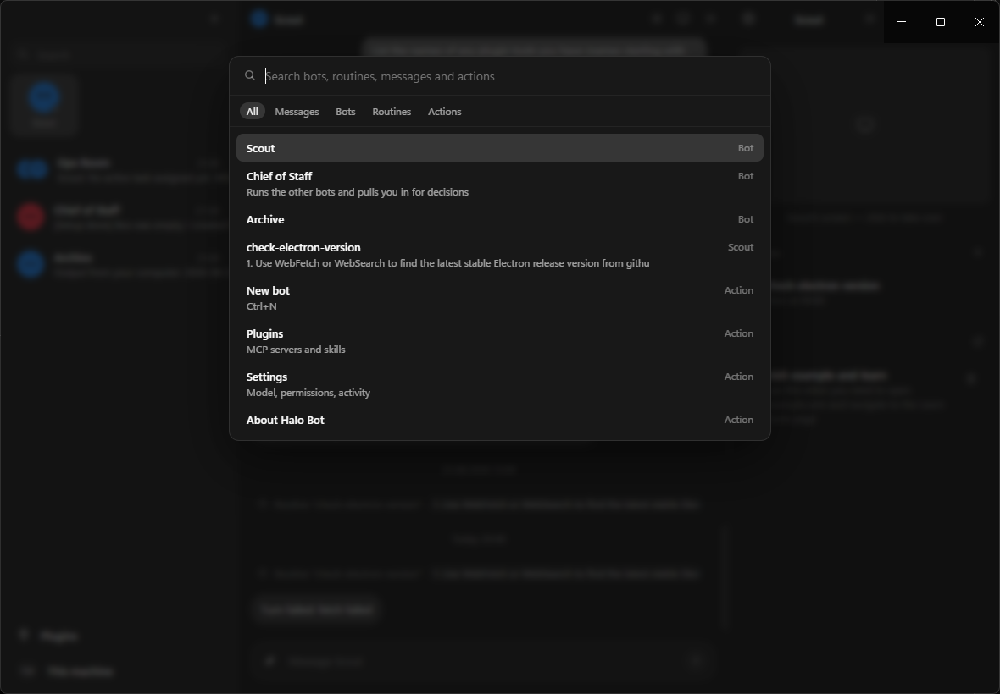
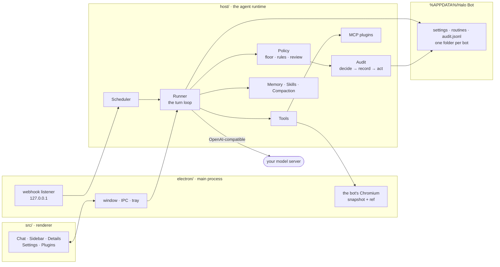

<div align="center">

# Halo Bot

**AI teammates you can give real work to — running on your own machine.**

Named bots with persistent memory, their own workspace and browser, routines on a schedule,
skills they learn by watching you, and an approval gate in front of anything that touches your
computer. Windows and Android. No cloud, no account, no telemetry.

[](host/halo.test.ts)
[](android/app/src/test/java/com/halo/bot/HaloTest.kt)
[](scripts/verify.mts)
[](LICENSE)
[](docs/ANDROID.md)


</div>

---

## Why this exists

In August 2026 xAI shipped **Grok Bot**: named agents with a persistent computer, a browser, a
schedule and an approval gate. It is a good product and this project is an unashamed clone of the
model of working it introduced — built from a teardown of the product, not from its code.

Then, in version 0.27, `dist/host/host-main.cjs` disappeared from its bundle. The whole agent
runtime moved onto xAI's servers. From that release, your bots' files, their browser sessions and
your logins live on somebody else's computer.

Halo Bot's runtime is a folder on yours.

That is the entire pitch, and everything below is a consequence of it.

| | Grok Bot 0.27 | Halo Bot |
|---|---|---|
| Where the agent runs | xAI's servers | your machine |
| Where your logins live | a shared cloud computer | a per-bot session on your disk |
| Isolation between bots | none — one computer, one credential pool <sup>[1](#f1)</sup> | its own box, its own browser session, its own permissions |
| Action-level audit trail | on the roadmap <sup>[2](#f2)</sup> | shipped — written *before* each action, with the rule that decided it |
| Model | Grok 4.6, metered | anything OpenAI-compatible: Ollama, LM Studio, llama.cpp, x.ai, OpenRouter, OpenAI, DeepSeek |
| Cost of running it | $200/month tiers | your electricity |
| Deleting a bot | may leave its files and sessions behind <sup>[1](#f1)</sup> | box, transcript, memory, skills and browser session, all gone |

<a name="f1">1.</a> [Grok Bot security, explained](https://cellcog.ai/blog/grok-bot-security/) —
"every credential on the machine is reachable by every Bot, present and future".
<a name="f2">2.</a> [Grok Bot for enterprise AI agents](https://beam.ai/agentic-insights/grok-bot-enterprise-ai-agents).

---

## What a bot actually does

<table>
<tr>
<td width="50%" valign="top">

**Its own box.** `%APPDATA%/Halo Bot/agents/<id>/box`, where `Shell`, `Read`, `Write`, `Edit` and
`ListFiles` run without asking. On Windows the folder is labelled Low integrity and commands run
through `halo-box.exe` inside a job object, so the kernel — not a regular expression — refuses
writes outside it. On Android it is the app sandbox, which is the same boundary for free.

**Its own browser.** A real Chromium screen you can watch live and take over with one click. The
bot works from a **snapshot**: it lists the page's controls with a ref each and clicks by ref, so
an action lands on the control Halo actually saw rather than a selector the model invented. One
browser has one driver — while you hold the wheel, the bot's actions there are refused, not queued.

**Your computer, behind the gate.** `ExternalShell`, `ExternalRead`, `CopyToBox`, `CopyFromBox`.

</td>
<td width="50%" valign="top">

**Teammates.** `CreateAgent`, `SendToAgent`, channels with `@mentions`. Bots hand work to each other
and post into rooms.

**Background workers.** `Task` hands a tightly-scoped job to a browser, research or shell worker.
`MessageSubagent` redirects one mid-flight without throwing away what it has found.

**Memory** in three tiers, extracted automatically after every exchange and loaded into every turn.

**Routines** on interval, daily, weekdays, weekly or **webhook** triggers — a loopback URL any
script, Task Scheduler or folder watcher can call.

**Your automations.** Point Halo at your own n8n and every service you have already connected there
becomes something a bot can read, write and fire — with the credentials staying in n8n.

**Plugins.** A marketplace of real, published MCP servers, plus *paste the config* for anything else.

</td>
</tr>
</table>

<div align="center">


</div>

---

## Staying in control

This is the part the product is actually about.


**A floor nothing can lower.** Wiping a drive, deleting your backups or shadow copies, formatting a
volume, rewriting the boot configuration: refused outright — with approvals off, with execution set
to Allow, with the folder granted, with a rule that says allow. Patterns are anchored to command
positions and checked against quote-masked and payload-unwrapped variants, so
`powershell -Command "Remove-Item C:\ -Recurse"` does not slip past by hiding inside a flag. There is
a test that turns every switch the wrong way and asserts it still refuses.

**Everything else asks, once, in the right words.** *Always allow / Allow once / Never* — and
"Always" is remembered **scoped to the action**, so approving `git status` grants commands starting
`git status`, not a shell.

**Rules in plain language, or as expressions.** *"when a bot wants to read files from my Downloads
folder → allow automatically"*, or
`intent == "run_command" && contains(command, "npm publish")` when a sentence will not do it. Deny
always beats allow, so a rule that removes permission cannot be defeated by a broader one that
grants it.

**Smart review.** The model gets a second opinion on anything the rules would wave through — with
the command's comments stripped and inside a fence, and your rules on the trusted channel, so a
comment in the command cannot argue its own way past the check.

**Dry run.** Decide and record without blocking, so you can watch a new rule work before it starts
refusing things. The floor still refuses.

**The trail.** Every gated action, allowed, refused or failed, with the rule that decided it. The row
is written *before* the action runs, so nothing acts without appearing there — and a permitted action
that then failed gets its own second row, because "allowed" and "happened" are different facts.
Anything shaped like a key is masked before it reaches disk.

**Everything from outside is data, never instructions.** A web page, a file, a plugin's reply, a
teammate's message, a background worker's report, text inside a screenshot — all of it arrives wrapped
in a marker whose suffix is random per run, and the bot is told that nothing inside it can order an
action. A page cannot close a fence it has never seen, and the marker is stripped out of the content
as well, so it cannot forge one either.


---

## Install

Build the installer yourself:

```bash
npm install
npm run package
```

`release/Halo Bot Setup 0.1.0.exe` installs the app with a Start-menu and desktop shortcut, and can
start with Windows.

Run it from source:

```bash
npm start          # build and launch
npm run dev        # hot reload
```

The phone build:

```bash
cd android && ./gradlew :app:installDebug
```

### First run

The setup screen looks for a model server on this machine (Ollama, LM Studio, llama.cpp) and ranks
what it finds by whether it supports tool calling and whether it fits in your memory. You can also
paste a key for x.ai, OpenRouter, OpenAI or DeepSeek. Anything OpenAI-compatible works; the model
needs tool calling, and vision if you want your bots to look at screenshots.

> **The model needs a context window of at least ~8k.** The system prompt plus the tool schemas is
> several thousand tokens, and a server with a smaller window silently truncates the request — the
> model never sees its instructions, answers in plain text, and the turn ends with nothing sent.
> Ollama's default is 4096, which is below that floor: start it with `OLLAMA_CONTEXT_LENGTH=16384`.
> Halo says so in the transcript when it detects a truncated prompt.

---

## Architecture



Every tool call goes through **one** gate. It summarises the action, asks the policy for a verdict,
optionally asks the model for a second opinion, writes the audit row, and only then executes — the
main loop and background workers alike, so there is exactly one place where permission is decided.

```
electron/   main process: window, IPC, the bot's browser, teach recorder, webhook listener
host/       agent runtime: store, provider, tools, policy, memory, skills, subagents,
            runner, scheduler, MCP, fence, compaction, expression, audit, personas, n8n
src/        renderer: React
native/     halo-box — a Rust helper that runs a box command at Low integrity in a job object
android/    the phone build: core/ ports host/, platform/ replaces electron/, ui/ follows src/
docs/       the teardowns this was built from, and the record of every pass over it
```

---

## Verification

```bash
npm run typecheck                              # tsc, clean
npm test                                       # 52 tests, node's runner, no framework
npm run verify                                 # 18 checks, the whole loop end to end
cd android && ./gradlew :app:testDebugUnitTest # 42 tests on the JVM
```

`npm run verify` is the interesting one. It starts an OpenAI-compatible server on loopback that plays
a **scripted** sequence of tool calls, builds a store and a runner in a temp directory, and drives the
real loop — because asking a real model to attempt a disk wipe tests whether *that model* is willing,
and a well-behaved one refuses on its own and never reaches the floor at all.

```
A turn, end to end
  PASS  SendMessage is the only channel, and it reaches the transcript
  PASS  a command on the user's machine stops at the approval gate
  PASS  what a tool brought back reaches the model fenced
  PASS  Halo's own answer about its own state is not fenced
The trail
  PASS  a gated action leaves a row
  PASS  the row names who decided it and how
  PASS  a box command is on the trail too, not only the gated ones
The floor, with every switch turned the wrong way
  PASS  refused: Remove-Item C:\ -Recurse -Force
  PASS  refused: powershell -Command "Remove-Item C:\ -Recurse -Force"
  PASS  refused: format C: /fs:ntfs
  PASS  refused: vssadmin delete shadows /all
  PASS  refused: bcdedit /set {default} safeboot minimal
Background work
  PASS  the worker's report comes back fenced — a report is a model repeating what it read
```

The desktop and Android suites deliberately contain **the same tests in two languages**: a property
that holds on Windows and not on the phone is a bug in whichever half is wrong, and these say which.

---

## Making a bot

**Ctrl+N**, or **+** in the sidebar. A name is the only required field.

- **A template** fills the whole bot — role, brief and a voice that suits the job. Nine of them,
  from Scout to Tutor to Build Bot.
- **A voice.** Colleague, Terse, Warm, Mentor, Analyst, Deadpan, Pirate, Сеньор, or one you write.
  A voice changes how a bot sounds and nothing else: it cannot widen what the bot may do, switch off
  an approval prompt, or make a refused action allowed — and the prompt says so to the model as well
  as to you.
- **A model.** The global one, or a different one for this bot alone. A heavy bot can run a bigger
  model than a watcher, and its background workers run on the same one it does.

### Teach it a task

Open a bot's computer, press **Teach a task**, do the thing once, press stop. Halo records the real
clicks, typing and navigations and the bot saves it as a skill with the selectors intact. Passwords
are never recorded — a password field is captured as `<secret>`.

The skill is the *shape* of the task, not a replay: anything that would differ next time becomes a
named input written `{like_this}`, with the demonstrated value kept as the example. It ends with a
line naming what it will not do on its own — pay, buy, or send on your behalf — and the bot offers a
dry run so you can watch it once before it matters.

### Per-bot permissions

| | |
|---|---|
| **On your computer** | `Use global / Ask every time / Allow / Never`, for that bot alone |
| **Folders it may use freely** | real folders; inside them nothing asks, outside them everything does |
| **Model** | its own, overriding the global default |
| **Browser session** | its own cookie jar, deleted with the bot |

---

## Android

The same product on a phone, as a Kotlin/Compose **port** rather than a wrapper: same bots, same
memory, same routines, same approval gate and audit trail, and the same layout on disk — a bot
exported on Windows imports on the phone with its voice, memory, skills and routines intact.

Four things the platform decided differently, and they are all in Halo's favour except the last: the
box is a real sandbox rather than a folder with a label, so `ExternalShell` is gone and there is
nothing for it to escape into; the folders a bot may use are grants Android itself holds rather than
paths Halo polices; the browser is a WebView in the details pane with the same snapshot-and-ref
contract; and plugins are remote MCP servers over Streamable HTTP, because a phone cannot spawn an
npm package.

The whole list is in **[docs/ANDROID.md](docs/ANDROID.md)**.

---

## Keyboard

| Shortcut | Action |
|---|---|
| `Ctrl+K` | Command palette: bots, routines, messages, actions (`Tab` cycles the tabs) |
| `Ctrl+N` | New bot |
| `Enter` / `Shift+Enter` | Send / newline |
| Right-click a bot | Pin, move to section, duplicate, export, hide, delete |

---

## Under the hood

- Turns run as a tool loop against an OpenAI-compatible endpoint. Failures are **classified** rather
  than guessed at: a rate limit or a 5xx is retried, an expired key or a missing model is reported
  once and not retried, and a context overflow is compacted and tried again — the one class where a
  second attempt can actually differ.
- Long chats fold their older turns into a summary once they pass the context budget, so a bot can
  run for weeks.
- Memory extraction, safety review and summarising all use a cheap **helper model**, keeping the main
  one free for work.
- Past eight plugin tools the schemas stop travelling in every prompt: the bot gets `ListPluginTools`
  and `CallPluginTool` and looks them up on demand, which is what keeps a small local model's window
  usable.
- A shell command sees an **allow-list** of environment variables — PATH, locale, proxy — and not this
  process's environment, so `Get-ChildItem env:` cannot print what the app decrypted at boot.
- Everything is files: `settings.json`, `channels.json`, `routines.json`, `usage.jsonl`,
  `audit.jsonl`, and one folder per bot with its transcript, model history, memory, skills and box.
- The API key, plugin credentials and any endpoint header are encrypted with the OS keychain
  (`safeStorage`) or the Android keystore before they reach disk. Everything else stays readable.
- A bot can also be **somebody else's agent**: give it an AG-UI endpoint and its turns run there, on
  any framework — offered Halo's toolset, with every call coming back through the same gate and onto
  the same trail. Hosting a foreign agent is not the same as trusting it.

---

## Not done yet

- **OAuth for hosted MCP servers** — Linear, Notion, Jira, Asana, Canva, Sentry, Vercel, PayPal,
  Square and Intercom publish servers that sign you in through a browser. Halo sends one static
  credential per server, so those are named as unsupported rather than listed and then failing.
- **One cookie jar on Android.** `CookieManager` is a singleton over the WebView data directory, so
  per-bot sessions there need a second process.
- **On-device inference on Android** — the model is always something Halo talks to over the network.
- **Reordering sidebar sections by dragging.**

---

## Documentation

| | |
|---|---|
| [docs/GROK_BOT_TEARDOWN.md](docs/GROK_BOT_TEARDOWN.md) | the original at 0.18: tools, prompt, model of working |
| [docs/GROK_BOT_INTERNALS.md](docs/GROK_BOT_INTERNALS.md) | its runtime, unpacked |
| [docs/GROK_BOT_0.24_0.27_TEARDOWN.md](docs/GROK_BOT_0.24_0.27_TEARDOWN.md) | what changed by 0.24 and 0.27, including the move to the cloud |
| [docs/OPENBOT_HERMES_TEARDOWN.md](docs/OPENBOT_HERMES_TEARDOWN.md) | the two MIT projects the floor, the trail and the retry policy come from |
| [docs/ANDROID.md](docs/ANDROID.md) | the phone build and every deliberate divergence |
| [docs/WORK_2026_08_27.md](docs/WORK_2026_08_27.md) | making the two builds one product |
| [docs/WORK_2026_09_03.md](docs/WORK_2026_09_03.md) | the fence's back door, the gate's race, and eight other defects |

---

## Licence

MIT — see [LICENSE](LICENSE).

Halo Bot is a clone of the *model of working* Grok Bot introduced, built from a teardown of that
product rather than from its code. Parts of the approval floor, the audit trail, the browser snapshot,
the take-the-wheel state and the retry policy are ports of decisions — and in a few places of logic —
from two MIT-licensed projects, [OpenBot](https://github.com/CopilotKit/OpenBot) and
[Hermes Agent](https://github.com/NousResearch/hermes-agent). Both are named at the point of use in
the source; the full attribution is in [NOTICE](NOTICE).
